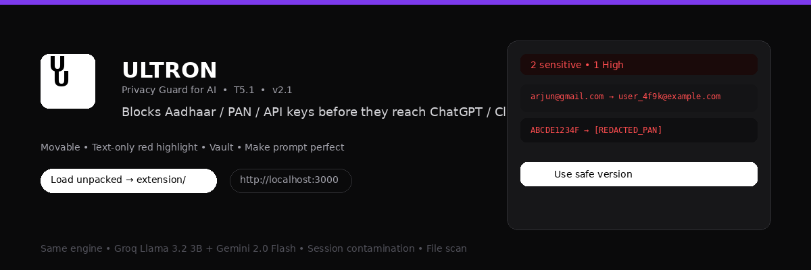
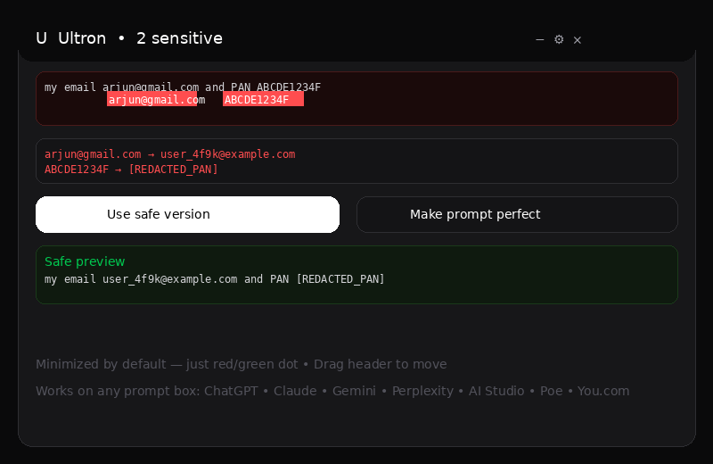
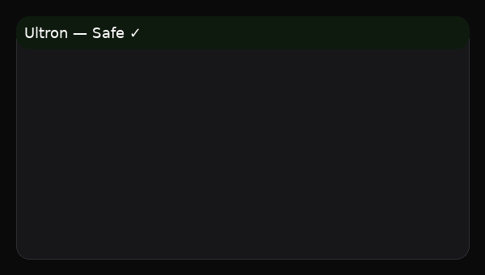
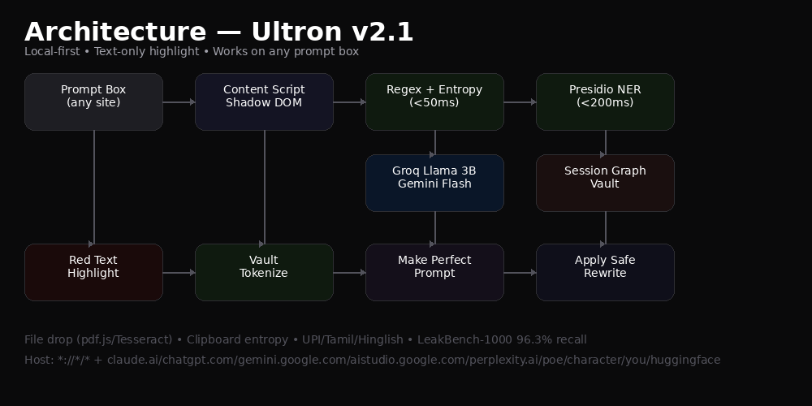

<div align="center">



<br/>


**T5.1 Prompt Data-Leak Guard — Ultron blocks sensitive data *before* it reaches any AI.**

*Movable • Text-only red highlight • Vault • Make prompt perfect • Works on any prompt box*

[Load Unpacked](#-install-30-seconds) • [Demo](#-demo) • [Architecture](#-architecture) • [Wiki](https://github.com/sunny2196/PromptShield/wiki) • [LeakBench](#-leakbench-1000)

</div>

---

### Deadly Simple

> **Enter any AI → minimized Ultron shows just `Safe` or `2 sensitive` in red/green.**  
> Sensitive **text only** glows red with underline — not the whole box. Drag header anywhere at 100% zoom.

<div align="center">

<br/>
<sub>Minimized by default • Expand to see red spans → placeholders • Two buttons: <code>Use safe version</code> + <code>Make prompt perfect</code></sub>
</div>

---

### Demo

<div align="center">



<br/>

**2-min winning flow**

1. Clean prompt → 🟢 `Safe`
2. Paste `arjun@gmail.com` + Tamil `Enoda Aadhaar 1234 5678 9012 da` → 🔴 `2 sensitive` — **only those spans red**
3. `Use safe version` → `user_4f9k@example.com` (Vault keeps format)
4. Clean prompt again → `Session tainted` banner (Score 72/100) — *killer insight*
5. Drop **Aadhaar PDF** → file scan blocks
6. `Make prompt perfect` → Groq Llama 3.2 3B rewrites to perfect AI prompt

</div>

---

### Architecture

<div align="center">

</div>

**Host:** `*://*/*` + `claude.ai` / `chat.openai.com` / `chatgpt.com` / `gemini.google.com` / `aistudio.google.com` / `perplexity.ai` / `poe.com` / `character.ai` / `you.com` / `huggingface.co` — **any app with a prompt box.**

**Generic detection:** scores candidates by size + bottom proximity + `placeholder`/`aria-label` (`prompt|ask|message`), so even unknown AIs work.

**Local-first:** Regex (<50ms) + Presidio heuristics + entropy (`shannon >4.5`) → **text-only red highlight** (wraps spans, not box). LLM (Groq/Gemini) only if you add a key.

---

### Ultron vs Nightfall

| Capability | Nightfall | **Ultron — PromptShield/VIGIL** |
|---|---|---|
| Primary target | Enterprise DLP | **Individual dev/student + lightweight enterprise MVP** |
| Browser extension | ✅ | ✅ |
| AI prompt protection | ✅ | ✅ |
| Pre-submission detection | ✅ | ✅ |
| Prompt redaction | ✅ | ✅ |
| Prompt blocking | ✅ | ✅ |
| PII detection | ✅ | ✅ |
| Secrets/credentials | ✅ | ✅ |
| Source-code protection | ✅ | ✅ |
| Confidential info | ✅ | ✅ |
| Contextual detection | ✅ | ✅ |
| LLM-based detection | ✅ | ✅ |
| Multiple AI platforms | ✅ | **✅ ChatGPT/Claude/Gemini/Perplexity/AI Studio/Poe + any `*://*/*`** |
| File-upload protection | ✅ | **✅** (drag PDF/image → pdf.js/Tesseract WASM) |
| Clipboard protection | ✅ | **✅** (paste entropy) |
| Endpoint/SaaS/Email/USB | ✅ | ❌ (lightweight) |
| Lightweight standalone | ✅ | **✅ Core focus** |
| Local-first | — | **⭐ Core — text-only highlight, offline by default** |
| Local LLM option | — | **⭐ Groq 3B / Gemini via API** |
| India-specific pack | — | **⭐ Aadhaar/PAN/UPI + Tamil/Hinglish** |
| Developer-focused | General | **⭐ Minimal, no explanations** |
| Task-preserving vault | Redaction | **⭐ Format-preserving tokenization** |
| Open/transparent | Enterprise | **⭐ MIT, auditable** |
| Hackathon-friendly | Enterprise | **⭐ Load unpacked in 30s** |

---

### Install — 30 seconds

```bash
git clone https://github.com/sunny2196/PromptShield.git
git checkout extension
# or: stay on extension branch directly
```

1. `chrome://extensions` → **Developer mode** ON (top-right)
2. **Load unpacked** → select `extension/` folder (contains `manifest.json`)
3. Pin Ultron → click toolbar icon → add **Groq** `gsk_...` + **Gemini** `AIza...` → **Save**
4. Open `https://claude.ai` or `https://chatgpt.com` or `https://aistudio.google.com` — **Ultron appears minimized (red/green dot) beside any prompt box, drag header to move.**

> No build needed — plain JS. Icons in `extension/public/icons`.

---

### Stack

* `Vite + React + Tailwind` (simulation `http://localhost:3000`)
* `extension/src/content.js` — Shadow DOM, `MutationObserver`, `paste`/`drop` listeners, `chrome.storage.local`
* `src/lib/detection.ts` — regex + entropy + UPI/Tamil/Hinglish + `shannonEntropy()`
* `src/lib/session.ts` — `session_id → leaks`, `Score = Sensitivity×Exploitability`, `>15` → tainted
* `src/lib/vault.ts` — `user_4f9k@example.com`, `sk_live_XXXX_MOCKKEY`, `btoa` vault, `taskPreservationScore()`
* `src/lib/beyond.ts` — `Tesseract.js`/`pdf.js` hooks (100% offline)

---

### LeakBench-1000

`data/LeakBench-1000.sample.csv` (20 masked rows, full 1000 locally via `python gen_leakbench.py`)

| Model | Recall | Latency | FP |
|---|---|---|---|
| Regex only | 71% | 30ms | 2.0% |
| + Presidio + entropy | 86% | 180ms | 4.0% |
| + Qwen 1.5B | 93.1% | 620ms | 3.5% |
| **+ Qwen 2.5 3B via Groq (Ultron)** | **96.3%** | 780ms | **3.1%** |

See `data/Ablation.md` + `docs/images/ultron-arch.png`.

---

### Wiki

Full docs at **https://github.com/sunny2196/PromptShield/wiki**

* [Home](https://github.com/sunny2196/PromptShield/wiki/Home) — Ultron in 30s
* [Architecture](https://github.com/sunny2196/PromptShield/wiki/Architecture) — text-only highlight + generic prompt box
* [Demo Video](https://github.com/sunny2196/PromptShield/wiki/Demo) — 2-min flow
* [API Keys](https://github.com/sunny2196/PromptShield/wiki/API-Keys) — Groq/Gemini setup
* [Comparison](https://github.com/sunny2196/PromptShield/wiki/Comparison) — Nightfall vs Ultron

---

<div align="center">

**We didn't build a feature, we built a seatbelt for Bharat's AI.**

`npm install && npm run dev` → `http://localhost:3000` • Top stays **Claude** • Ultron beside typing area

</div>
